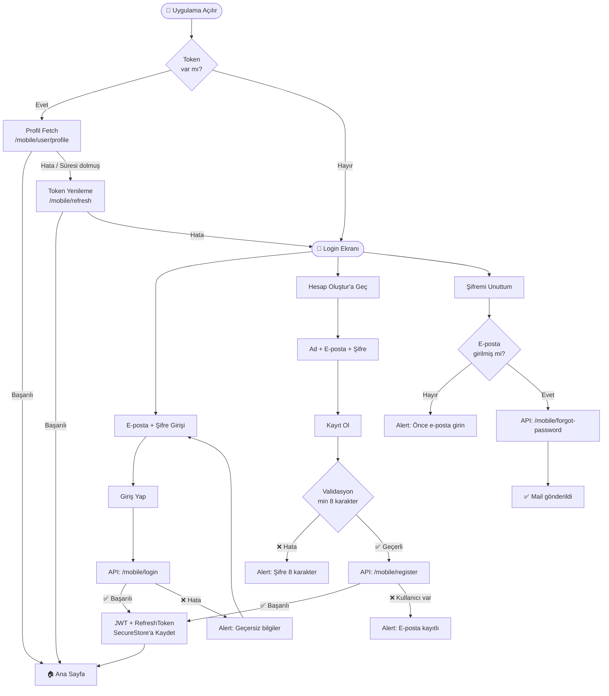
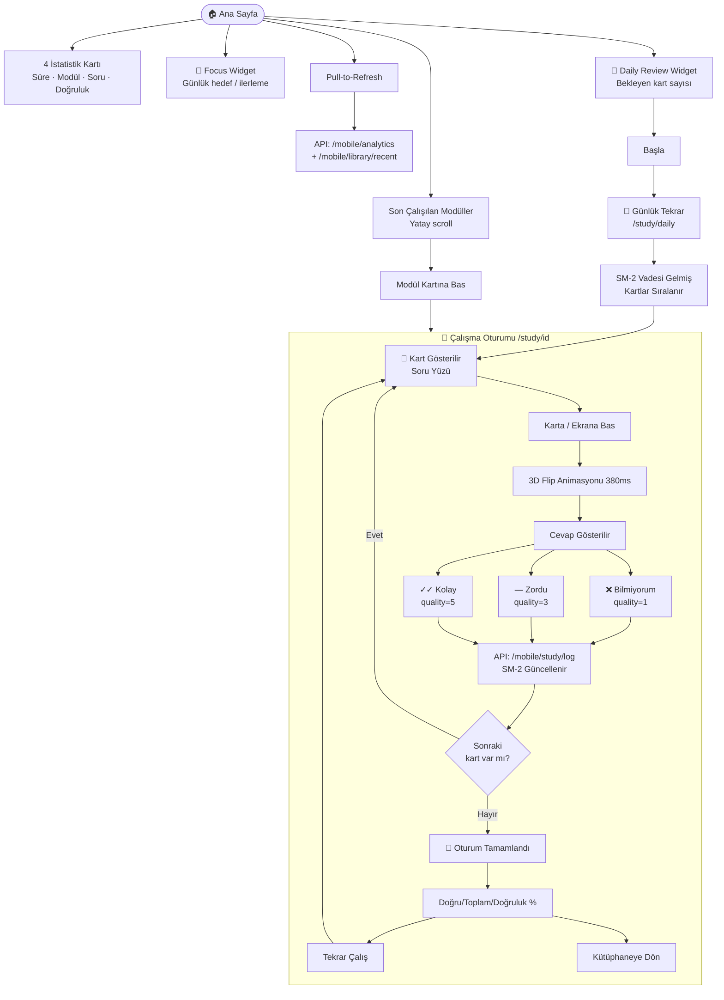
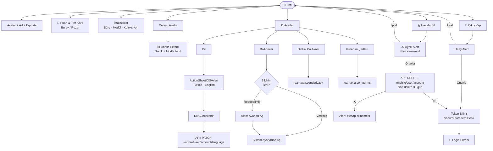
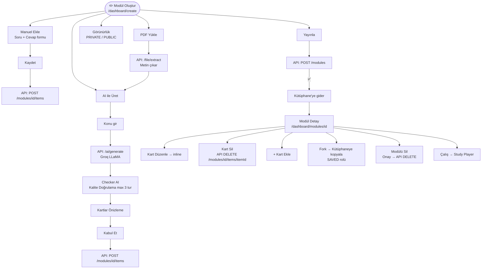
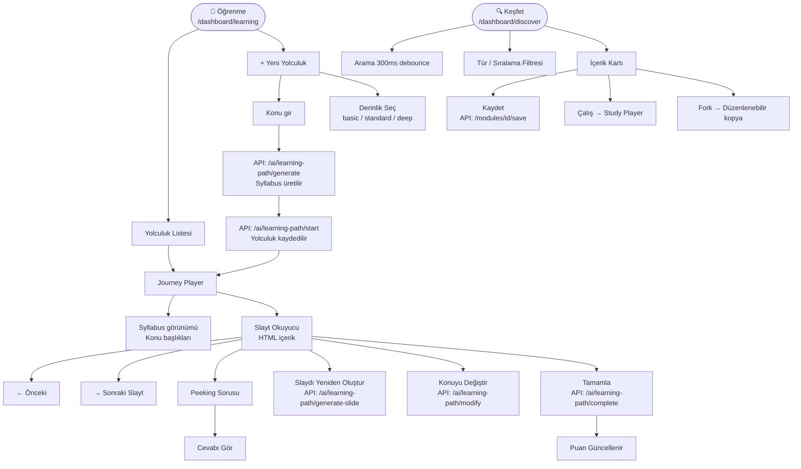
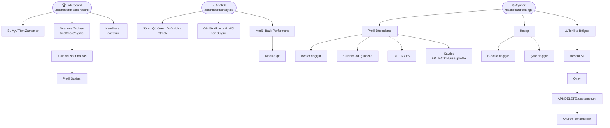
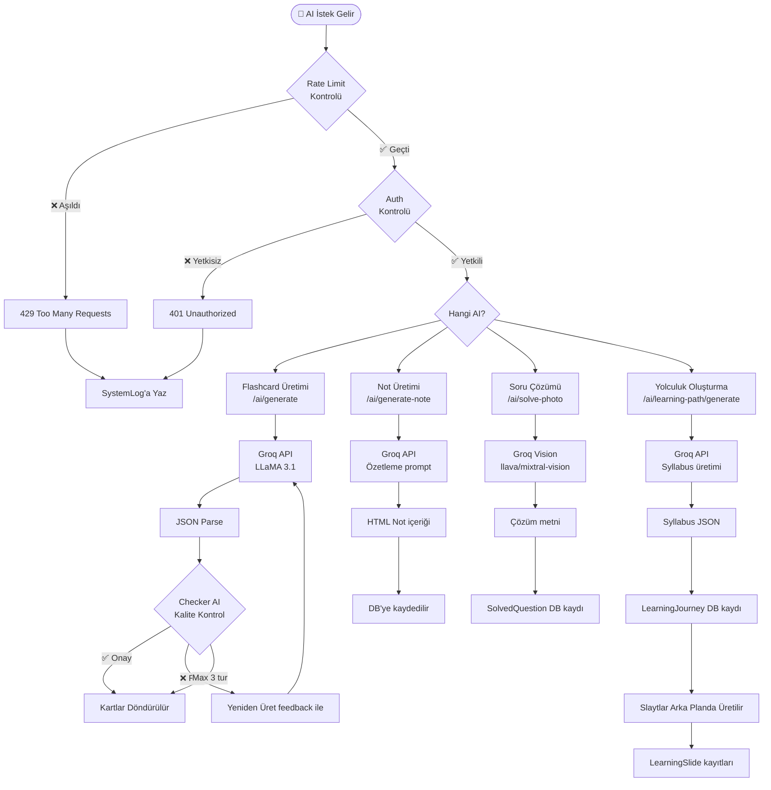
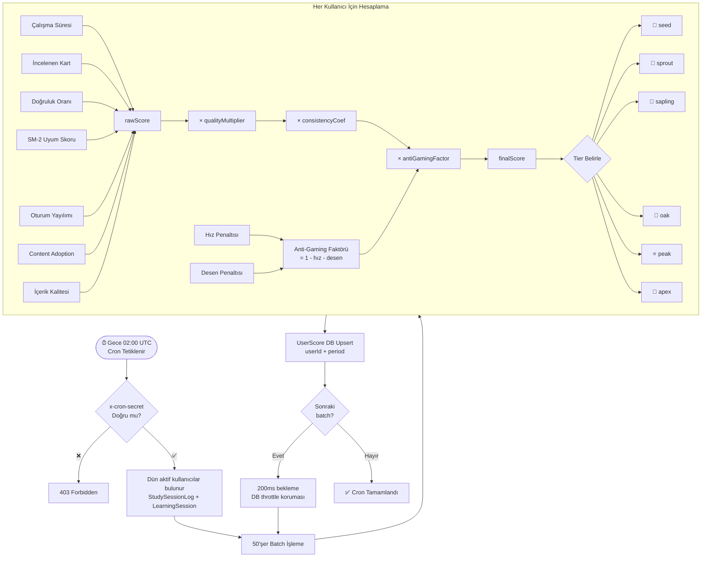
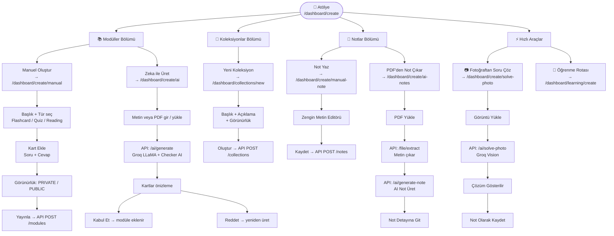

# Learnaxia — Görsel Akış Şemaları

> Her tuş, her geçiş, her API çağrısı haritası. Son güncelleme: 17 Haziran 2026.
> 🟦 Ekran · 🟧 AI İşlemi · 🟩 Başarı · 🟥 Hata/Tehlike · ⬜ Aksiyon

---

## 1️⃣ AUTHENTICATION AKIŞI



---

## 2️⃣ MOBİL — ANA SAYFA & GÜNLÜK TEKRAR



---

## 3️⃣ MOBİL — KÜTÜPHANe

```mermaid
flowchart TD
    LIB([📚 Kütüphane])
    LIB --> TAB_M[Modüller Tab]
    LIB --> TAB_C[Koleksiyonlar Tab]
    LIB --> TAB_N[Notlar Tab]

    TAB_M --> SEARCH_M[Arama Çubuğu\nAnlık filtreleme]
    TAB_M --> MOD_CARD[Modül Kartı]
    MOD_CARD --> GO_STUDY[/study/id]
    TAB_M --> LOAD_MORE[Sonsuz Scroll\n12'şer yükleme]

    TAB_C --> COL_CARD[Koleksiyon Kartı]
    COL_CARD --> COL_DETAIL[/collections/id\nİçindeki modüller]
    COL_DETAIL --> MOD_IN_COL[Modül Kartı]
    MOD_IN_COL --> GO_STUDY
    TAB_C --> BTN_NEW_COL[+ Yeni Koleksiyon]
    BTN_NEW_COL --> NEW_COL_SCR[/collections/new\nBaşlık + Açıklama]
    NEW_COL_SCR --> CREATE_COL[Oluştur]
    CREATE_COL --> API_COL[API: POST /mobile/collections]
    API_COL -->|✅| BACK_LIB_COL[Kütüphaneye Dön]

    TAB_N --> NOTE_CARD[Not Kartı]
    NOTE_CARD --> NOTE_DETAIL[/notes/id\nİçerik görüntüle]
    NOTE_DETAIL --> EDIT_NOTE[Düzenle]
    NOTE_DETAIL --> DEL_NOTE[Sil]
    DEL_NOTE --> API_DEL_NOTE[API: DELETE /mobile/notes/id]
    TAB_N --> BTN_NEW_NOTE[+ Yeni Not]
    BTN_NEW_NOTE --> NEW_NOTE_SCR[/notes/new\nBaşlık + İçerik]
    NEW_NOTE_SCR --> SAVE_NOTE[Kaydet]
    SAVE_NOTE --> API_NOTE[API: POST /mobile/notes]
```

---

## 4️⃣ MOBİL — OLUŞTUR (AI Merkezi)

```mermaid
flowchart TD
    CREATE([➕ Oluştur Ekranı])

    CREATE --> CAM_BTN[📷 Fotoğraf Çek / Yükle]
    CAM_BTN --> PERM{Kamera\nİzni?}
    PERM -->|Verildi| CAM_OPEN[Kamera Açılır]
    PERM -->|Reddedildi| ERR_PERM[Alert: Kamera erişimi\ngerekli]
    CAM_OPEN --> TAKE_PHOTO[📸 Çek]
    CAM_OPEN --> GALLERY[Galeriden Seç]
    TAKE_PHOTO --> PREVIEW[Önizleme]
    GALLERY --> PREVIEW
    PREVIEW --> SEND_PHOTO[Gönder]
    SEND_PHOTO --> API_VISION[API: POST /mobile/ai/solve-photo\nGroq Vision]
    API_VISION -->|✅| SOLUTION_MODAL[SolutionModal\nSoru + AI Çözümü]
    API_VISION -->|❌ Rate Limit| ERR_RATE[Alert: Çok fazla istek]
    API_VISION -->|❌ Hata| ERR_VIS[Alert: Görüntü analiz edilemedi]
    SOLUTION_MODAL --> SAVE_AS_NOTE[Not Olarak Kaydet]
    SAVE_AS_NOTE --> NOTE_SCREEN[/notes/id]
    SOLUTION_MODAL --> CLOSE_MODAL[Kapat]

    CREATE --> DOC_BTN[📄 Belge Yükle]
    DOC_BTN --> DOC_PICK[DocumentPicker\nPDF / TXT]
    DOC_PICK --> API_EXTRACT[API: POST /mobile/file/extract\nMetin çıkar]
    API_EXTRACT --> API_GENNOTE[API: POST /mobile/ai/generate-note\nAI Not Üret]
    API_GENNOTE -->|✅| NOTE_SCREEN
    API_GENNOTE -->|❌| ERR_NOTE[Alert: Not üretilemedi]

    CREATE --> TOPIC_BTN[🧭 Konu Gir]
    TOPIC_BTN --> TOPIC_MODAL[TopicModal\nKonu başlığı gir min 3 karakter]
    TOPIC_MODAL --> BTN_CREATE_J[Oluştur]
    BTN_CREATE_J --> VAL_TOPIC{3 karakter\nvar mı?}
    VAL_TOPIC -->|Hayır| ERR_TOPIC[Alert: En az 3 karakter]
    VAL_TOPIC -->|Evet| API_GEN[API: /ai/learning-path/generate\nSyllabus üretilir]
    API_GEN --> API_START[API: /ai/learning-path/start\nYolculuk başlatılır]
    API_START -->|✅| JOURNEY_SCR[🧭 Journey Player\n/journey/id]
    API_START -->|❌| ERR_J[Alert: Yolculuk başlatılamadı]
```

---

## 5️⃣ MOBİL — PROFİL & AYARLAR



---

## 6️⃣ WEB — DASHBOARD

```mermaid
flowchart TD
    LANDING([🌐 Landing Page /])
    LANDING --> BTN_LOGIN_W[Giriş Yap]
    LANDING --> BTN_TRY[Başla / Ücretsiz Dene]
    BTN_LOGIN_W --> LOGIN_W[/login]
    BTN_TRY --> LOGIN_W

    LOGIN_W --> CRED[E-posta + Şifre]
    LOGIN_W --> GOOGLE[Google ile Giriş]
    CRED --> NEXTAUTH[NextAuth Credentials]
    GOOGLE --> OAUTH[Google OAuth Callback]
    NEXTAUTH --> DASH
    OAUTH --> DASH

    LOGIN_W --> FORGOT_W[Şifremi Unuttum\n/forgot-password]
    FORGOT_W --> RESET_MAIL[Resend → Doğrulama maili]
    RESET_MAIL --> VERIFY[/auth/verify?token=...]
    VERIFY --> DASH

    LOGIN_W --> REGISTER_W[Kayıt Ol]
    REGISTER_W --> REG_FORM[Kullanıcı adı + E-posta + Şifre]
    REG_FORM --> VERIFY_MAIL[Doğrulama maili gönderilir]
    VERIFY_MAIL --> VERIFY

    DASH([🏠 Dashboard\n/dashboard])
    DASH --> ONBOARDING{İlk giriş\nmi?}
    ONBOARDING -->|Evet| ONBOARD_MODAL[4 Adımlı Onboarding Modal]
    ONBOARD_MODAL --> CLOSE_ONBOARD[Başla → Modal kapanır\nonboardingComplete=true API'ye]
    ONBOARDING -->|Hayır| DASH_CONTENT

    DASH --> DASH_CONTENT[4 İstatistik · Focus Widget\nDaily Review · Score Card]
    DASH_CONTENT --> DAILY_BTN_W[Günlük Tekrarı Başlat]
    DAILY_BTN_W --> STUDY_DAILY_W[/study/daily]
    DASH_CONTENT --> LEADERBOARD_BTN[Liderboard]
    LEADERBOARD_BTN --> LEADER_W[/dashboard/leaderboard]
```

---

## 7️⃣ WEB — MODÜL OLUŞTURMA & YÖNETİM



---

## 8️⃣ WEB — JOURNEY PLAYER & KEŞFEt



---

## 9️⃣ WEB — LIDERBOARD, ANALİTİK, AYARLAR



---

## 🔟 AI KATMANI — TAM AKIŞ



---

## 1️⃣1️⃣ PUANLAMA SİSTEMİ — ARKA PLAN



---

## 📌 EKSİKLİK / GELİŞTİRME İPUÇLARI

---

## 1️⃣2️⃣ WEB — ATÖlye (Create Hub)



---

## 1️⃣3️⃣ WEB — PROFİL SAYFASI

```mermaid
flowchart TD
    PROF_W([👤 Profil\n/dashboard/profile])

    PROF_W --> AVATAR_W[Avatar + Handle + Katılma Tarihi]
    PROF_W --> STATS_CARDS[3 İstatistik Kartı\nÜretimler · Koleksiyonlar · Başarı Puanı]

    PROF_W --> EDIT_BTN[Profili Düzenle]
    EDIT_BTN --> EDIT_DIALOG[EditProfileDialog Modal]
    EDIT_DIALOG --> UPD_HANDLE[Handle güncelle]
    EDIT_DIALOG --> UPD_AVATAR_W[Avatar güncelle]
    EDIT_DIALOG --> SAVE_PROF_W[Kaydet → API PATCH /user/profile]

    PROF_W --> SHARE_BTN[Paylaş]
    SHARE_BTN --> SHARE_URL[Profil URL kopyalanır\nlearnaxia.com/@handle]

    PROF_W --> PROF_TABS[3 Tab]
    PROF_TABS --> TAB_MOD_P[Üretimlerim\nRole=OWNER modüller]
    PROF_TABS --> TAB_COL_P[Koleksiyonlarım]
    PROF_TABS --> TAB_NOTE_P[Notlarım]

    TAB_MOD_P --> MOD_CARD_P[Modül Kartına Bas]
    MOD_CARD_P --> MOD_DETAIL_P[Modül Detay / Study]
    TAB_MOD_P --> EMPTY_MOD[Boşsa → Atölye'ye Git]
    EMPTY_MOD --> ATOLYE_LINK[/dashboard/create]

    TAB_NOTE_P --> NOTE_CARD_P[Not Kartı]
    NOTE_CARD_P --> NOTE_DETAIL_P[Not Detay]
    TAB_NOTE_P --> EMPTY_NOTE[Boşsa → Not Yaz]
    EMPTY_NOTE --> MANUAL_NOTE_LINK[/dashboard/create/manual-note]
```

---

## 1️⃣4️⃣ WEB — KOLEKSİYON AKIŞI

```mermaid
flowchart TD
    COL_W([📁 Koleksiyonlar\n/dashboard/collections])

    COL_W --> COL_LIST_W[Koleksiyon Listesi]
    COL_LIST_W --> COL_CARD_W[Koleksiyon Kartına Bas]
    COL_CARD_W --> COL_DETAIL_W[/dashboard/collections/id\nİçindeki modüller]
    COL_DETAIL_W --> ADD_MOD_COL[Modül Ekle]
    COL_DETAIL_W --> REM_MOD_COL[Modülü Kaldır]
    COL_DETAIL_W --> MOD_IN_COL_W[Modüle Bas → Study Player]
    COL_DETAIL_W --> DEL_COL_W[Koleksiyonu Sil]
    DEL_COL_W --> CONFIRM_COL[Onay → API DELETE /collections/id]

    COL_W --> NEW_COL_BTN[+ Yeni Koleksiyon]
    NEW_COL_BTN --> NEW_COL_FORM[/dashboard/collections/new\nBaşlık + Açıklama + Görünürlük]
    NEW_COL_FORM --> CREATE_COL_BTN[Oluştur → API POST /collections]
    CREATE_COL_BTN --> COL_DETAIL_W
```

---

## 1️⃣5️⃣ WEB — ADMİN PANELİ (/admin)

```mermaid
flowchart TD
    ADMIN_GATE{ADMIN\nRolü Kontrolü}
    ADMIN_GATE -->|❌ Yetkisiz| REDIRECT_DASH[/dashboard'a yönlendir]
    ADMIN_GATE -->|✅ ADMIN| ADMIN_HOME

    ADMIN_HOME([🔧 Admin Dashboard\n/admin])
    ADMIN_HOME --> ADMIN_STATS[4 Kart\nKullanıcı · Modül · Kart · Kütüphane]
    ADMIN_HOME --> HEALTH[Sistem Sağlığı\nDB Bağlantı · Auth · Environment]

    ADMIN_HOME --> NAV_MODULES[Modüller]
    NAV_MODULES --> ADMIN_MODS[/admin/modules\nTüm modüller listesi]
    ADMIN_MODS --> MOD_DELETE_A[Modül Sil]
    ADMIN_MODS --> MOD_TOGGLE_PUB[Görünürlük Değiştir]

    ADMIN_HOME --> NAV_USERS[Kullanıcılar]
    NAV_USERS --> ADMIN_USERS[/admin/users\nKullanıcı listesi]
    ADMIN_USERS --> CHANGE_ROLE[Rol Değiştir\nUSER → ADMIN]
    ADMIN_USERS --> BAN_USER[Kullanıcı Banlama]

    ADMIN_HOME --> NAV_SYSTEM[Sistem]
    NAV_SYSTEM --> ADMIN_SYSTEM[/admin/system\nLogs + AI Logs]
    ADMIN_SYSTEM --> VIEW_LOGS[/admin/system/logs\nSystemLog kayıtları]
    ADMIN_SYSTEM --> VIEW_AI_LOGS[/admin/system/ai-logs\nAI istek logları]
    VIEW_LOGS --> FILTER_LOGS[Level filtresi\nERROR · WARN · INFO]
    VIEW_LOGS --> CLEAR_LOGS[Logları Temizle]

    ADMIN_HOME --> NAV_TOOLS[Araçlar]
    NAV_TOOLS --> ADMIN_TOOLS[/admin/tools\nBakım araçları]
    ADMIN_TOOLS --> REPAIR_BTN[🔧 Reputation Repair\nEksik kütüphane kayıtlarını onar]
    REPAIR_BTN --> CONFIRM_REPAIR[Onayla → repairLibrariesAction]
    CONFIRM_REPAIR --> REPAIR_DONE[✅ Kütüphaneler onarıldı]

    ADMIN_TOOLS --> RESET_BTN[🗑️ Veritabanını Sıfırla\nKullanıcılar hariç]
    RESET_BTN --> CONFIRM_RESET[⚠️ Onayla → resetContentAction]
    CONFIRM_RESET --> RESET_DONE[✅ İçerik silindi]

    ADMIN_TOOLS --> SEED_BTN[🌱 Test Verisi Üret\n6 modül + 5 koleksiyon + 3 not]
    SEED_BTN --> CONFIRM_SEED[Onayla → seedTestDataAction]
    CONFIRM_SEED --> SEED_DONE[✅ Test verisi eklendi]
```

---

## 📌 EKSİKLİK / GELİŞTİRME İPUÇLARI

> Bu şemalar üzerinden eksikleri kolayca görebilirsin:

| Alan | Mevcut | Eksik / Geliştirilebilir |
|------|--------|---------------------------|
| 📱 Mobil Auth | E-posta + Şifre, Şifre sıfırlama | Google ile Giriş (mobilde yok) |
| 📱 Create Tab | PDF, Fotoğraf, Konu | Ses kaydından not üretimi |
| 📱 Study | Flashcard (SM-2) | Quiz modu mobilde eksik |
| 📱 Profile | Analitik bağlantısı | Rozet detay ekranı yok |
| 📱 modal.tsx | Mevcut ama boş | Henüz kullanılmıyor, placeholder |
| 🌐 Atölye | 6 aksiyon tam | — |
| 🌐 Profil | 3 tab + paylaş + düzenle | Başarı Puanı kartı "çok yakında" |
| 🌐 Koleksiyonlar | CRUD tam | Koleksiyona toplu modül ekleme yok |
| 🌐 Web Keşfet | Modül + Koleksiyon | Kullanıcı profili görüntüleme yok |
| 🌐 Notlar | AI + Manuel | Notlar arası bağlantı/etiket yok |
| 🤖 AI | 4 farklı özellik | Push bildirim sistemi yok |
| 💎 Skor | Aylık hesaplama | Gerçek zamanlı güncelleme yok |
| 📊 Analitik | Grafik + modül bazlı | Zayıflık analizi eksik |
| 🔧 Admin | Dashboard + 4 bölüm | Admin activity log boş (placeholder) |

